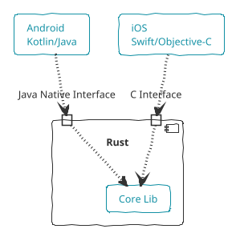
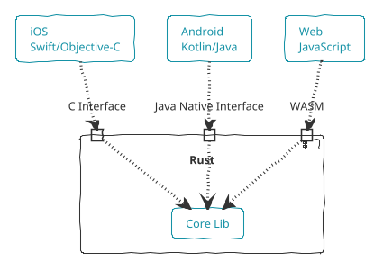

# Architecture

In this section we're going to talk about the architecture of this library

## Core

The heart of our library, it contains code that works independent from
the OS and the chip. The `core` of the library should be like any rust
library out there, our twist is porting it to other platforms.

## Glue

Porting our rust library requries us to write glue code, each platform has
its set of conventions they follow. Java has JNI (Java Native Interface) and
iOS uses C conventions.

## Core + Glue

So our architecture is making the logic inside of `core` using rust,
and our problem will be only about writing glue code.

Now when we want to introduce another platform, the web for an instance,
we only have to worry about writing a glue code to support web.

