# Project Setup

## Cargo Workspace

This section talks about the initial project setup and structure.

We will create a new rust project and make it a workspace to cross-reference
multiple crates inside our project.

```bash
cargo new exa-library
```

Change the directory to `exa-library` and delete the `src` folder

Finally, replace the content of `Cargo.toml` with our workspace configuration

```toml
[workspace]
members = []
```

## Core Crate

We are going to add crates to our workspace as we go. The first crate is going
to be our core crate.

```bash
cargo new exa_core --lib --vcs none
```

> We do not need a version control system on the new crates
> since it already created one when we ran `cargo new exa-library`.

Then add `exa_core` to the root `Cargo.toml`.

```toml [hl,3]
[workspace]
members = [
    "exa_core"
]
```

The result of this part should have this folder structure:

```plantuml,format=svg
@startsalt
{
    {T
        + exa-library
            ++ .gitignore
            ++ Cargo.lock
            ++ Cargo.toml
            ++ exa_core
                +++ Cargo.toml
                +++ src
                    ++++ lib.rs
            ++ target/
    }
}
@endsalt
```



> `Cargo.lock` and `target` might be missing if the project wasn't built yet.

## Mobile Crate

The mobile crate is going to hold the mobile-specific bindings and dependencies.
Writing the bindings in a separate create will make our library modular,
so in the future, if we want to add WASM support, we create a new crate
and write the bindings there without touching the core crate.

Create the new crate:

```bash
cargo new glue/mobile --lib --vcs none
```

Add it to our workspace:

```toml [hl,4]
[workspace]
members = [
    "exa_core",
    "glue/mobile"
]
```

Final project structure:

```plantuml,format=svg
@startsalt
{
    {T
        + exa-library
            ++ .gitignore
            ++ Cargo.lock
            ++ Cargo.toml
            ++ exa_core
                +++ Cargo.toml
                +++ src
                    ++++ lib.rs
            ++ glue
                +++ mobile
                    ++++ Cargo.toml
                    ++++ src
                        +++++ lib.rs
            ++ target/
    }
}
@endsalt
```


